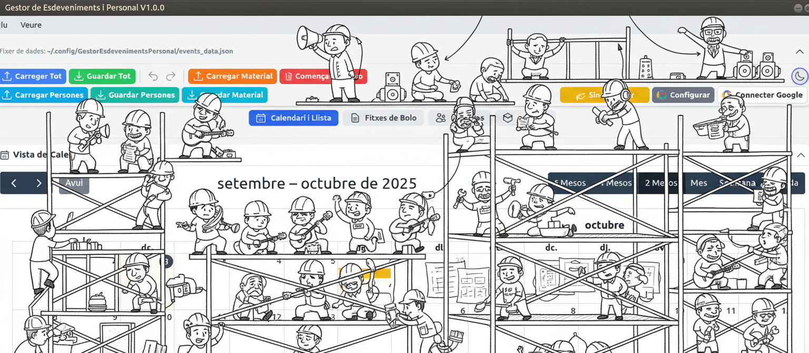

### `README.md`**

# Gestor d'Esdeveniments i Personal V1.6.4 (ABRIL 2026)

Aplicació d'escriptori multiplataforma (Electron, React, Vite) per a la gestió integral d'esdeveniments, personal, fitxes de bolo i material, complementada amb una **aplicació mòbil** (React Native, Expo) que permet la **gestió i edició** de dades en mobilitat.

El projecte està actualment en fase de desenvolupament actiu.

## Funcionalitats Principals

Aquesta aplicació està dissenyada per ser una solució integral per a professionals del sector dels esdeveniments, com ara directors de producció, caps tècnics o empreses de lloguer de material. El seu objectiu és centralitzar i simplificar tota la logística que envolta un esdeveniment, cobrint tot el cicle de vida, des de la planificació inicial fins a l'execució tècnica.

L'aplicació ofereix les següents eines:

*   **Gestió d'Esdeveniments i Assignacions (Escriptori):**
    *   Crea "esdeveniments marc" amb dates i notes generals.
    *   Assigna personal per dies concrets i controla'n l'estat (Confirmat, Pendent, No disponible, Mixt).
    *   El sistema detecta automàticament conflictes si una persona és assignada a múltiples llocs el mateix dia.

*   **Planificació i Visualització (Escriptori):**
    *   **Calendari Avançat:** Visualitza tots els esdeveniments en múltiples formats (2, 4 o 6 mesos, mes, setmana i agenda). 
    *   **Llista Dinàmica:** Filtra i ordena els esdeveniments per nom, lloc, persona, estat o data per a una visió detallada.

*   **Documentació Tècnica (Escriptori):**
    *   Genera fitxes tècniques completes ("Fitxes de Bolo") per a cada esdeveniment.
    *   Gestiona el personal per proveïdors i rols, i les necessitats de material (il·luminació, so, vídeo, etc.).
    *   **Reordena els proveïdors de personal amb drag-and-drop** per a una organització visual.

*   **Gestió d'Actuacions Artístiques (Escriptori, ):**
    *   **Mòdul d'Actuacions:** Crea i edita actuacions per a cada esdeveniment (contacte, horaris d'arribada/soundcheck/show/sortida, notes tècniques i d'hospitalitat).
    *   **Control d'Avançament:** Seguiment visual amb 4 estats (Rider Rebut, Contra-rider Enviat, Horaris Confirmats, Hospitality Tancat).
    *   **Formularis Tècnics i Hospitality:** Input list, notes de llums/vídeo/escenari, camerinos, càtering, dietes, logística i pàrquing.
    *   **Exportació PDF:** Riders individuals per actuació i resum d'actuacions (escaleta artística amb horaris i dades de les actuacions). La fitxa de bolo i el mòdul d'actuacions són independents; no hi ha export que combini ambdues fonts a la interfície actual.

*   **Inventari de Material (Escriptori):**
    *   Manté una base de dades centralitzada de material amb control d'estoc.
    *   El sistema comprova la disponibilitat de l'estoc en temps real en assignar material a una fitxa de bolo.
    *   **Centre de Control:** Analitza la demanda de material calculant el pic d'ús simultani per dies (demanda concurrent), oferint una previsió d'estoc real.

*   **Connectivitat i Gestió de Dades (Escriptori):**
    *   **Format Natiu `.gep`:** L'aplicació utilitza per defecte l'extensió personalitzada **`.gep`** (Gestor Esdeveniments Personal), la qual cosa professionalitza l'eina i permet l'obertura directa de fitxers amb doble clic. Es manté **compatibilitat total** de lectura i escriptura amb arxius `.json` tradicionals.
    *   **Integració amb Google Calendar:** Sincronitza els esdeveniments a **múltiples calendaris** de Google gestionats per l'app i visualitza altres calendaris personals.
    *   **Importació/Exportació:** Permet fusionar o reemplaçar dades de personal i material des d'altres fitxers.
    *   **Exportació a PDF/CSV:** Exporta resums, llistes, inventaris i fitxes de bolo a formats professionals amb noms de fitxer intel·ligents.

----

*   **Aplicació Mòbil (iOS/Android):**
    *   **Funcionalitat Completa:** Permet crear, editar i eliminar Esdeveniments, Persones i Material.
    *   **Gestió de Dades `.gep` i `.json`:** Obre, edita i desa fitxers en el format natiu **`.gep`** o en el format tradicional `.json`, oferint una gestió de dades completa i flexible des de qualsevol lloc.

    *   **Mode Fosc:** Gaudeix d'una experiència visual còmoda en condicions de poca llum. El tema es pot canviar fàcilment des de la capçalera i la preferència es desa per a futures sessions.
    *   **Gestió de Fitxers Avançada:**
        *   **Obertura Universal:** Utilitza el selector de fitxers natiu per obrir arxius des de l'emmagatzematge local, Google Drive, Dropbox o qualsevol altre proveïdor.

    *   **Flux de Desat i Exportació (Important):**
        *   **Desar com a / Compartir:** A causa de les restriccions de seguretat en Android i iOS,l'aplicació no sempre pot sobreescriure directament el fitxer original al núvol.

        *   **Actualització al Núvol:** Per desar canvis en serveis com Google Drive o Dropbox, utilitza el botó **"Compartir"** i selecciona l'opció de reemplaçar el fitxer existent a la teva app de núvol, o desa'l localment i puja'l de nou.
        
    *   **Navegació Intuïtiva:** Una interfície amb pestanyes per accedir ràpidament a cada secció i icones clares per a totes les accions.
    *   **Interacció Millorada:** S'han afegit Botons d'Acció Flotants (FAB) per a la creació ràpida d'elements, i les accions d'ordenació i filtratge es gestionen a través de modals.

> Per a una anàlisi tècnica detallada de l'arquitectura, consulta la nostra [**guia de desenvolupament (DEVELOPING.md)**](DEVELOPING.md).

## 💾 Descàrrega i Instal·lació (App Escriptori)

Pots descarregar l'última versió de l'aplicació directament des de la nostra secció de [**Releases a GitHub**](https://github.com/Pepelocotango/Gestor-Events_i_Personal/releases).

Cada versió inclou binaris compilats per a Windows, macOS i Linux. Assegura't de descarregar el fitxer correcte per al teu sistema operatiu.

### Requisits Mínims del Sistema

L'aplicació es construeix amb Electron 38, la qual cosa defineix els següents requisits mínims:

*   **Windows:** Windows 10 (només 64-bit) o superior.
*   **macOS:** macOS 10.15 (Catalina) o superior.
*   **Linux:** Es recomana una distribució moderna com Ubuntu 20.04, Debian 11, Fedora 34 o equivalents més recents (requereix glibc 2.31 o superior).

    > **Nota important per a Linux:** L'aplicació es distribueix com a AppImage, que requereix la llibreria `libfuse2`. En sistemes com **Ubuntu 22.04 o posteriors**, aquesta llibreria no ve instal·lada per defecte. Si l'aplicació no s'obre, necessitaràs instal·lar-la manualment amb la comanda:
    > ```sh
    > sudo apt-get install libfuse2
    > ```

---

### Instruccions per Plataforma

#### 🪟 **Windows**

Oferim dues versions per a Windows:

> **Nota IMPORTANT per a Windows:** Com que l'aplicació no està signada digitalment, és probable que Windows Defender SmartScreen la bloquegi. Per executar-la, hauràs de fer clic a **"Més informació"** a la pantalla blava d'avís i, a continuació, al botó **"Executar de totes maneres"**.
1.  **Instal·lador (`..._Setup.exe`):**
    *   **Recomanat per a la majoria d'usuaris.**
    *   Descarrega i executa el fitxer `.exe` que conté la paraula `Setup`.
    *   Això instal·larà l'aplicació al teu sistema, creant una drecera a l'escriptori i una entrada al menú d'inici per a un accés fàcil.

2.  **Versió Portable (`..._.exe`):**
    *   **Ideal per executar sense instal·lar, per exemple des d'un pen-drive.**
    *   Descarrega el fitxer `.exe`.
    *   Pots executar l'aplicació directament amb un doble clic sense que s'instal·li res al teu sistema.

####  **macOS**

Per a macOS, la distribució es fa a través d'un fitxer `.dmg`:

> **Nota IMPORTANT per a macOS:** Com que l'aplicació no està signada ni notariada per Apple, el sistema de seguretat (Gatekeeper) la bloquejarà per defecte. Aquest és un comportament esperat. Les següents instruccions et mostren com obrir l'aplicació en diferents situacions:
>
> ### Mètode Estàndard (funciona en la majoria de casos):
> 1.  **Obertura Inicial:** Després de copiar l'aplicació a la teva carpeta d'Aplicacions, fes **clic-dret** (o **Ctrl+clic**) sobre la seva icona i selecciona **"Obrir"**.
> 2.  **Primer Avís:** Si macOS mostra un avís dient que no pot verificar el desenvolupador, fes clic a **"Cancel·lar"**.
> 3.  **Segon Intent:** Torna a fer **clic-dret** i selecciona **"Obrir"** un altre cop.
> 4.  **Confirmació Final:** Ara hauries de veure un botó per **"Obrir"** l'aplicació. Fes-hi clic per executar-la.
>
> ### Si el mètode anterior no funciona (macOS Sequoia 15+ o error "Està malmesa"):
>
> **Opció A - Mitjançant Configuració del Sistema:**
> 1. Ves a **Configuració del Sistema** > **Privadesa i Seguretat**
> 2. Desplaça't cap avall fins a la secció "Seguretat"
> 3. Busca el missatge que diu "[Nom de l'aplicació] va ser bloquejada perquè no prové d'un desenvolupador identificat"
> 4. Fes clic a **"Obrir de totes maneres"** i confirma l'acció
>
> **Opció B - Mitjançant Terminal (per a l'error "Està malmesa" en Apple Silicon):**
> 1. Obre l'aplicació **Terminal** (la trobaràs a Aplicacions > Utilitats)
> 2. Copia i enganxa la següent línia i prem Retorn:
>    ```sh
>    xattr -cr /Applications/GestorEsdevenimentsPersonal.app
>    ```
> 3. Tanca la finestra de Terminal i torna a intentar obrir l'aplicació
>
> Aquests passos només són necessaris la primera vegada que obris l'aplicació. Un cop hagis confirmat que vols obrir l'aplicació, podràs obrir-la normalment amb un doble clic.

*   Descarrega el fitxer `...-macOS-10.15+.dmg`.
*   Fes-hi doble clic per obrir-lo. S'obrirà una finestra del Finder.
*   Per instal·lar l'aplicació, simplement **arrossega la icona de l'aplicació a la drecera de la carpeta d'Aplicacions** que apareix a la mateixa finestra.
*   Ja pots executar l'aplicació des de la teva carpeta d'Aplicacions o mitjançant Launchpad.

#### 🐧 **Linux**

Per a Linux, utilitzem el format `AppImage`, que no requereix instal·lació:

*   Descarrega el fitxer `...-Linux-Ubuntu18.04+.AppImage`.
*   **Dona-li permisos d'execució.** La manera més fàcil és fent clic dret sobre el fitxer > Propietats > Permisos > i marcar la casella "Permet executar el fitxer com un programa".
    *   Alternativament, des de la terminal: `chmod +x GestorEsdeveniments-*.AppImage`
*   Fes doble clic sobre el fitxer per executar l'aplicació.
---


### 📂 Fitxers d'Exemple

Per ajudar-te a començar, hem inclòs una carpeta anomenada `examples json` amb fitxers de dades que pots utilitzar.

*   **`example_all.json`**: És un arxiu de projecte complet amb esdeveniments, personal i material. Per utilitzar-lo:
    1.  Ves al menú **`Arxiu > Obrir...`**.
    2.  Selecciona el fitxer `example_all.json`.
    3.  L'aplicació carregarà el projecte. Pots desar els canvis amb `Guardar` o `Guardar com...`.

*   **`example_person.json`**: Conté una llista de contactes. Aquesta funció està pensada per **importar** contactes a un projecte existent.
    1.  Obre o crea un projecte.
    2.  Ves al menú **`Arxiu > Importar / Exportar > Importar Persones...`**.
    3.  Selecciona `example_person.json`.
    4.  L'aplicació et preguntarà si vols **fusionar** la nova llista amb l'existent (afegint només les persones que no existeixin) o **reemplaçar** completament la llista actual.

*   **`example_material.json`**: Un inventari de material d'exemple. Funciona de la mateixa manera que la importació de persones.
    1.  Obre o crea un projecte.
    2.  Ves al menú **`Arxiu > Importar / Exportar > Importar Material...`**.
    3.  Tria entre **fusionar** l'inventari o **reemplaçar-lo**.


---
## 🚀 Novetats i Funcionalitats Clau

* **Workshop de Riders (NOU):**
  * **Taller Tècnic Avançat:** Una nova interfície professional ("Workshop") dedicada exclusivament al disseny tècnic de patch i monitors.
  * **Control d'Estoc en Temps Real:** L'inventari lateral mostra la disponibilitat real restant, tenint en compte les assignacions de totes les actuacions de l'esdeveniment i d'altres produccions simultànies.
  * **Assignació "Point & Shoot":** Clica una cel·la de la taula (micròfon o peu) i selecciona directament el material de l'inventari per assignar-lo, evitant errors d'escriptura.
  * **Balanç Consolidat Integrat:** Una secció detallada (col·lapsable) que resumeix tot el material necessari per al conjunt del festival o esdeveniment, amb alertes visuals si se supera l'estoc disponible.
  * **Disseny Industrial Compacte:** Interfície d'alta densitat d'informació amb seccions col·lapsables (Inputs, Monitors, Notes, Balanç) i tooltips intel·ligents a cada cel·la.

* **Mòdul d'Actuacions (FASE 4):**
  * **Gestió d'actuacions artístiques** per esdeveniment: llista ordenable (drag-and-drop), formularis bàsic, tècnic i d'hospitalitat.
  * **Control d'avançament visual** amb 4 passos (Rider Rebut, Contra-rider Enviat, Horaris Confirmats, Hospitality Tancat).
  * **Exportació PDF:** riders individuals per actuació i resum d'actuacions (escaleta artística).
  * L'últim esdeveniment de actuacions visualitzat es recorda entre sessions.

* **Centre de Control de Material (Redissenyat):**
  * **Càlcul de Pic de Demanda Concurrent:** La nova lògica calcula la demanda màxima d'un ítem en un sol dia dins d'un període, oferint una previsió d'estoc molt més realista.
  * **Interfície Reorganitzada:** Les columnes s'han reordenat per prioritzar la informació d'estoc i balanç. L'ordenació per defecte ara ressalta els ítems amb més problemes de disponibilitat.
  * **Desglossament Enriquit:** El desglossament per esdeveniment ara inclou les dates, proporcionant un context immediat.

* **Millores en Exportacions (PDF i CSV):**
  * **Noms de Fitxer Intel·ligents:** Els fitxers exportats (PDF/CSV) ara tenen noms descriptius que reflecteixen automàticament els filtres aplicats (p. ex., `Llista_Esdeveniments_Persona_Pep_+Filtres.pdf`), millorant dràsticament l'organització i la claredat dels documents generats.
  * **Ordenació Jeràrquica:** Els informes PDF de resum i CSV ara presenten les dades ordenades jeràrquicament per categoria, origen i nom, facilitant la seva anàlisi.
  * **PDF de Resum Millorat:** S'ha afegit la columna "Origen" i s'han reorganitzat les columnes per a una major claredat.
  * **Correcció d'Exportació Detallada:** Solucionat un error que generava un PDF detallat buit si no se seleccionava cap esdeveniment al filtre. Ara, l'informe sempre reflecteix les dades visibles a la taula.

* **Gestió d'Estat amb Zustand:**
  * Estat global optimitzat amb selectors independents per evitar bucles infinits de renderitzat.
  * Historial desfer/refer interactiu amb modal, botons i descripcions clares d'acció.

* **Backups i Logs Optimizats:**
  * **Backups Contextuals:** El sistema ara només crea còpies de seguretat automàtiques en desar el fitxer de dades principal de l'aplicació, evitant generar backups innecessaris durant les exportacions a PDF o CSV.
  * **Rotació de Logs Intel·ligent:** S'ha optimitzat el sistema de logs per limitar automàticament el nombre i la mida dels fitxers, reduint l'ús d'espai en disc sense perdre l'historial d'errors recent.

* **Separació de Configuració Google:**
  * Configuració local (`google-config.json`) independent de la configuració de cada document.
  * Sincronització multi-calendari i gestió d'IDs separada per usuari i projecte.

* **Instància Única:**
  * Bloqueig d'instància per evitar errors d'escriptura i finestres duplicades.

* **Menú Personalitzat en React:**
  * Substitució del menú natiu d'Electron per un component React, amb accions IPC centralitzades.

* **Sistema d'Arxivatge:** Nova funcionalitat per arxivar esdeveniments antics, mantenint la llista principal neta i organitzada.

*   **Finestra "Sobre l'aplicació":** Accessible des del menú "Ajuda", mostra informació rellevant sobre la versió, descripció i enllaços del projecte.

*   **Interfície d'Usuari Renovada (Disseny XL):**
    *   **Alta Visibilitat:** Les targetes d'esdeveniments i assignacions s'han redissenyat amb una escala més gran, tipografies clares i botons més accessibles.
    *   **Mode "Focus Únic":** En treballar amb la llista, l'esdeveniment que estàs editant es destaca visualment amb un marc de color, ajudant-te a mantenir el context fins i tot quan tens molts elements oberts alhora.

* **Selector d'Idioma i Internacionalització Completa:**
    * **3 Idiomes Disponibles:** Totes les aplicacions (escriptori, mòbil i web) inclouen selector d'idioma amb suport complet per a **Català, Castellà i English**.
    * **Aplicació d'Escriptori:** Selector desplegable amb icona del globus, integrat a la interfície principal amb persistència de preferència.
    * **Aplicació Mòbil:** Selector visual amb banderes (🏴🇪🇸🇬🇧) i botons intuïtius, amb emmagatzematge local de la preferència d'idioma.
    * **Aplicació Web:** Sistema de rutes multillingüe (/ca/, /es/, /en/) amb selector desplegable i navegació transparent entre idiomes.
    * **Traduccions Completes:** Totes les cadenes de text, menús, missatges d'error i documentació estan traduïdes als tres idiomes.

* **Altres millores:**
  * **Sistema de Temes Automatitzat:** S'ha implementat un sistema de gestió de colors centralitzat. Tota la paleta de colors es defineix en un únic fitxer de configuració (`theme.config.cjs`) i un script automatitzat (`npm run build:theme`) genera tots els estils necessaris, garantint una consistència total entre el tema de l'aplicació (clar/fosc) i els elements externs com els PDF. Per a més detalls tècnics, consulta la [guia de desenvolupament](DEVELOPING.md).
  * **Disseny Fluid (Full-Width):** L'aplicació ara utilitza un disseny d'amplada completa que aprofita tot l'espai de la pantalla, reemplaçant l'anterior contenidor centrat per optimitzar la visualització en monitors grans.
  * Refactorització de stores, modals, tech_sheets i utils.
  * Gestió d'errors robusta amb logs de sessió i ErrorBoundary.

---
## Desenvolupament

## 🔒 Tancament Intel·ligent i Backups

L'aplicació prioritza la integritat de les teves dades amb un sistema de desat i backups segur.

-   **Diàleg de Sortida Únic:** En intentar tancar l'aplicació amb canvis no desats, es mostra un únic diàleg que t'ofereix un control clar: `Desa`, `Tanca sense desar` o `Cancel·la`.
-   **Backups Automàtics Contextuals:** Es crea automàticament un backup del teu document cada vegada que el deses amb èxit (`Guardar` o `Guardar com...`). Aquest sistema és intel·ligent: només s'activa en desar el fitxer de dades principal, no en exportar PDFs o CSVs. El sistema gestiona una rotació, conservant les còpies més recents per a cada document.

## ⚡ Configuració de Google: Separació Local vs Document

La configuració de Google Calendar es gestiona de forma separada:
- La configuració local (`google-config.json`) manté calendaris gestionats, calendaris externs i preferències de l'usuari.
- Quan obres un document, només s'actualitzen els calendaris gestionats i l'ID actiu; la resta de preferències romanen intactes.
- Això garanteix que la configuració personal no es perdi ni se sobreescrigui accidentalment.

Si vols contribuir al projecte, consulta la nostra [guia de desenvolupament](DEVELOPING.md) per obtenir informació sobre com configurar l'entorn i entendre els canvis recents.


## 📄 Llicència

Aquest projecte està sota la llicència **GNU General Public License v3.0**.

Això significa que ets lliure d'utilitzar, estudiar, modificar i compartir aquest software. No obstant això, qualsevol treball derivat que distribueixis ha de ser publicat sota aquesta mateixa llicència, garantint que el codi romangui sempre lliure i obert per a tota la comunitat.

Pots llegir el text complet de la llicència al fitxer [LICENSE](LICENSE) del projecte.

-------------------------------

## ✒️ Autoria i Agraïments

-   **Autor Principal:** Pëp 
-   **Suport Tècnic i Co-pilots:** Isaac ;) / Google Gemini, Google Studio IA, Jules, GitHub Copilot, Perplexity, ChatGPT, Claude.
-   **Entorn de Desenvolupament:** VSCode, Windsurf, Cursor, Android Studio, Sublime Text, GitHub Desktop i Antigravity.

Aquest projecte se sosté sobre les espatlles de gegants. Un agraïment especial a:

*   **Ecosistema Web i Escriptori:** Als creadors de **React, Electron, Vite i Tailwind CSS** per la potència i flexibilitat, i a **FullCalendar** per la seva excel·lent llibreria.
*   **Món Mòbil:** A l'equip de **React Native** i molt especialment a **Expo**, per fer el desenvolupament mòbil accessible i modern.
*   **Web:** A **Astro** per l'arquitectura de la web i a **Vercel** per l'allotjament.
*   **Recursos:** Als dissenyadors de **Heroicons** i **Lucide**.
*   **La Comunitat:** A tot l'univers **GNU/LINUX** i Open Source.
*   **L'Origen:** Al **Planeta Terra**, per donar-nos els recursos, l'energia i la vida per crear.

Vull estendre aquest agraïment a tots els creadors de recursos, eines i dependències que fan possible aquest projecte i que, per desconeixement o omissió involuntària, no he esmentat explícitament.

I finalment, gràcies a la paciència dels que m'envolten mentre estic immers en el projecte.

**Visca el codi lliure!!** 🐧
